<div align="center">
  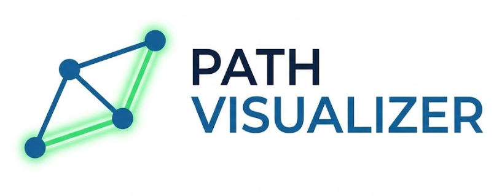
  
  <p><strong>Interactive Graph Algorithm Visualizer & Pathfinding Engine</strong></p>

  
  
  
  
</div>

<br />

---

## Overview
**Path Visualizer** is a desktop application designed to visualize complex graph algorithms in real-time. It bridges the gap between abstract computer science theory and real-world application by allowing users to map nodes onto custom floorplans, simulate traffic constraints, and watch algorithms like **Dijkstra** and **A*** hunt for optimal paths.

Built with **Python** and **Tkinter**, this project demonstrates proficiency in data structure manipulation, algorithm optimization, and Model-View-Controller (MVC) software architecture.

<div align="center">
  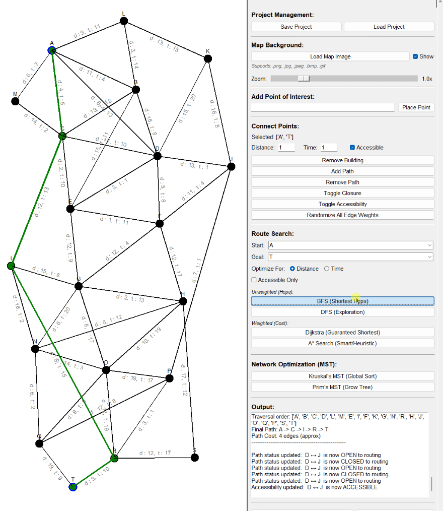
</div>

---

## Visual Legend
The application uses a strict color-coding system to convey the state of the graph and the results of algorithmic operations.

| Visual Element | Color | Description |
| :--- | :--- | :--- |
| **Optimal Path** | **Green** | The final path calculated by BFS, DFS, Dijkstra, or A*. |
| **MST Connection** | **Blue** | Structural edges selected by Kruskal's or Prim's algorithm for the Minimum Spanning Tree. |
| **Scanning Node** | **Yellow** | Indicates a node currently being processed/visited by the algorithm (Algorithm State). |
| **Closed Path** | **Red** | A path manually toggled as "Closed." Algorithms treat this as a roadblock. |
| **Inaccessible** | **Orange** | A path marked "Not Accessible" (e.g., stairs). Search agents requiring accessibility will ignore these. |
| **Standard Edge** | **Black** | A standard, open, bidirectional edge awaiting traversal. |

---

## Workflow & Features

### 1. Environment Setup
Path Visualizer is designed for flexibility. Users can load custom floorplans (PNG/JPG) to simulate real-world navigation or use the blank canvas for abstract graph theory. The "Project Management" toolbar handles saving/loading JSON states and resetting the workspace.

<div align="center">
  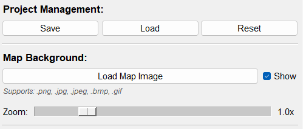
  <p><em>Toolbar: Save/Load State, Reset Canvas, Import Map, and Zoom Controls.</em></p>
</div>

The application includes a custom-built zoom and pan engine to navigate large maps efficiently.

<div align="center">
  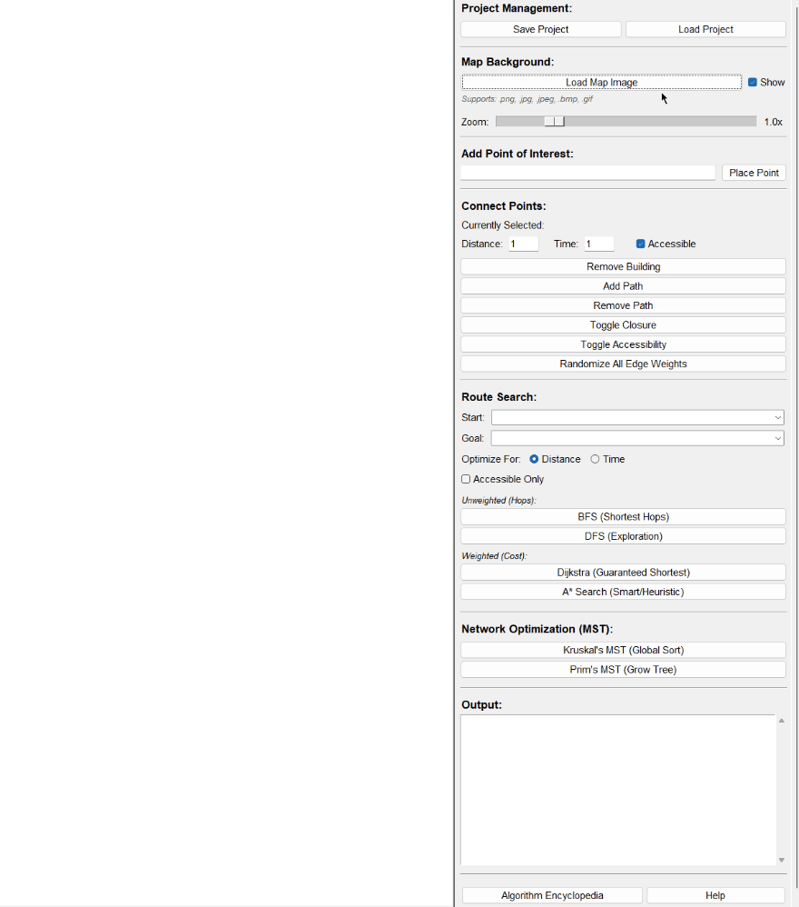
  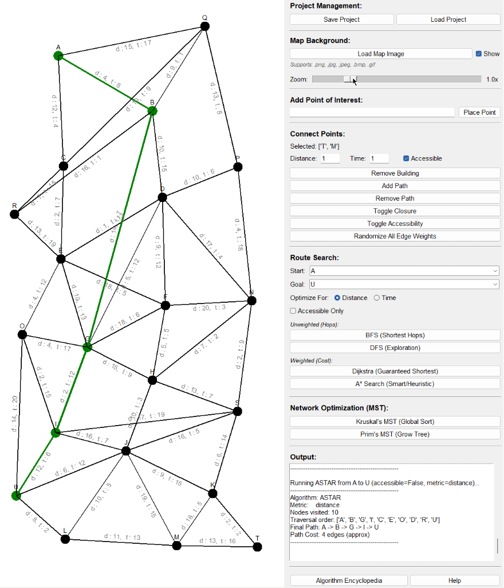
  <p><em>Left: Importing a floorplan. Right: Dynamic zooming for precision.</em></p>
</div>

### 2. Graph Construction
Users can build graphs intuitively using two methods:
1.  **Precision Mode:** Type a name, click "Place Point," then click the map.
2.  **Quick Mode:** Type a name and click anywhere on the canvas instantly.

The "Build Panel" allows for connecting nodes, removing elements, and simulating real-world constraints like road closures (Red) or accessibility issues (Orange).

<div align="center">
  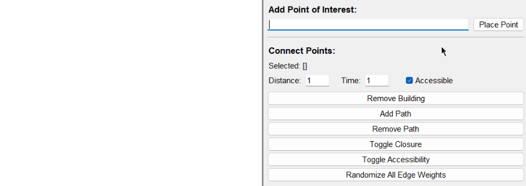
  <p><em>Demonstrating node placement, edge creation, closure toggling (Red), and randomizing weights.</em></p>
</div>

<div align="center">
  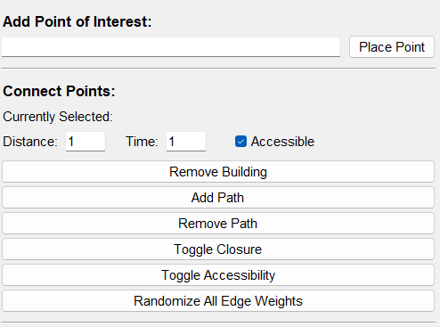
  <p><em>Build Panel: Controls for adding points, edges, and toggling constraints.</em></p>
</div>

### 3. Pathfinding Analysis
The core of Path Visualizer is the pathfinding engine. Users can select a Start and Goal, choose a metric (**Distance** vs. **Time**), and execute four different search algorithms.

* **Unweighted:** BFS (Shortest Hops) and DFS (Exploration).
* **Weighted:** Dijkstra (Guaranteed Shortest Path) and A* Search (Heuristic Optimization).

<div align="center">
  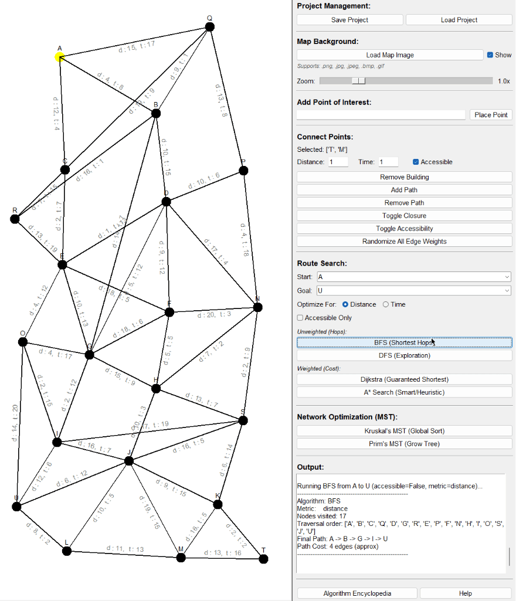
  <p><em>Visualizing the scan process (Yellow) and the final path (Green).</em></p>
</div>

<div align="center">
  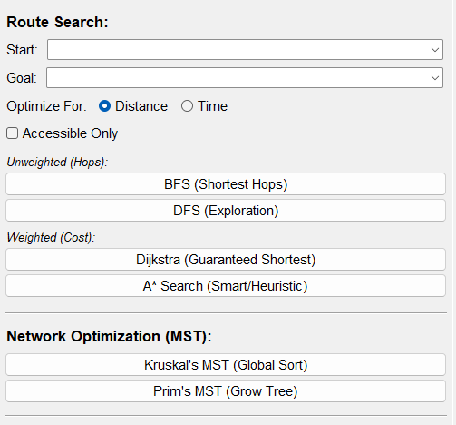
  <p><em>Algorithm Panel: Route selection, Metric toggles, and Execution buttons.</em></p>
</div>

### 4. Network Optimization (MST)
Beyond navigation, the tool solves network design problems using **Kruskal's** and **Prim's** algorithms. These generate a **Minimum Spanning Tree (MST)**—connecting all nodes with the minimum possible total edge weight, visualized in **Blue**.

<div align="center">
  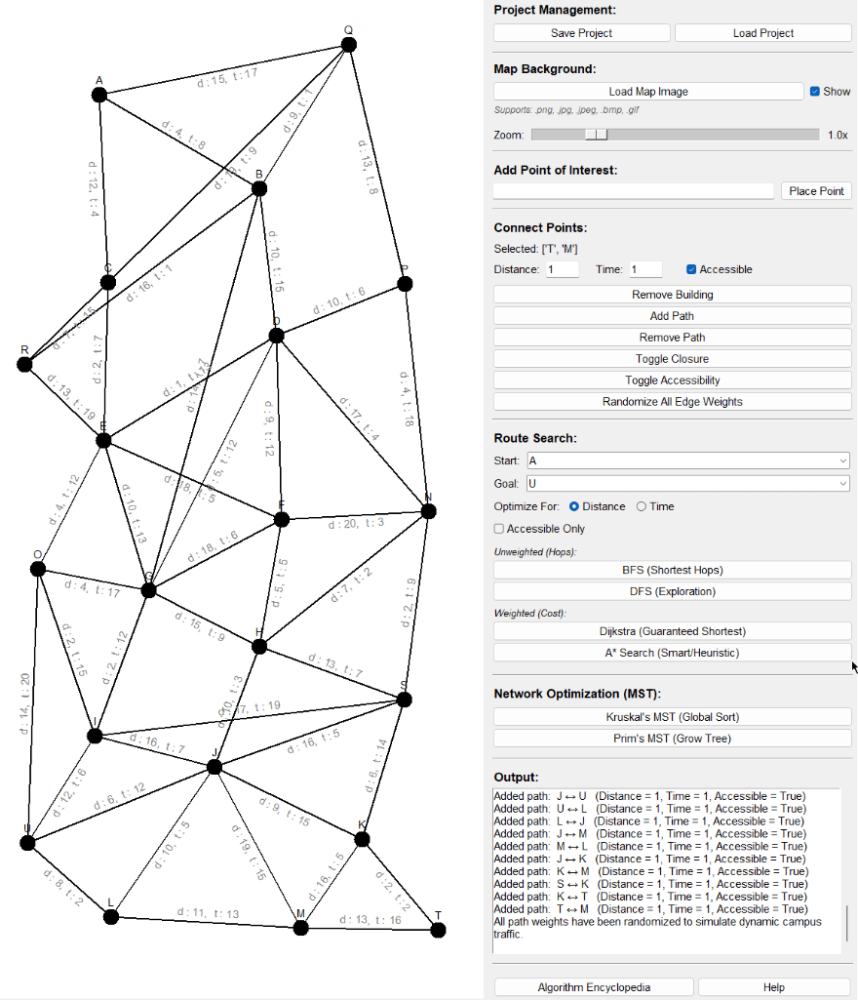
  <p><em>Generating a cost-effective network structure using MST algorithms (Blue).</em></p>
</div>

### 5. Documentation & Feedback
The application features a robust feedback system. The output log details every step, cost, and traversal order. Integrated popups serve as an educational resource, explaining the time complexity and logic behind every algorithm.

<div align="center">
  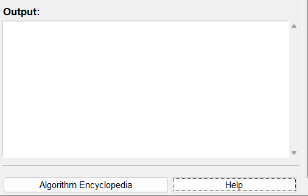
  <p><em>Real-time logging of algorithm performance and costs.</em></p>
</div>

<div align="center">
  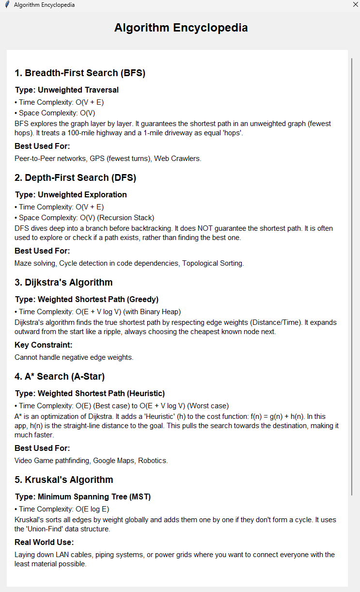
  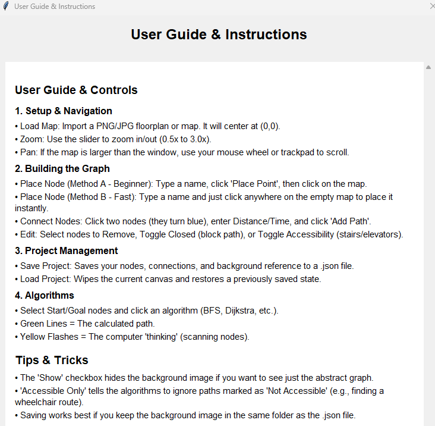
  <p><em>Left: Integrated Algorithm Encyclopedia     Right: User Guide</em></p>
</div>

---

## Tech Stack
* **Language:** Python 3.x
* **GUI Framework:** Tkinter (customized with `ttk` styling)
* **Image Processing:** Pillow (PIL)
* **Architecture:** Modular MVC (Model-View-Controller)
* **Data Structures:** Priority Queues (`heapq`), Hash Maps, Disjoint Sets.

---

## Usage

### Running the Executable (Windows)
1.  Download `Path Visualizer.exe` from the Releases tab.
2.  Ensure your map images (if using any) are in a known directory.
3.  Double-click to launch.

### Running from Source
1.  Clone the repository:
    ```bash
    git clone https://github.com/Ryu-134/Path-Visualizer.git
    ```
2.  Install dependencies:
    ```bash
    pip install -r requirements.txt
    ```
3.  Run the entry point:
    ```bash
    python main.py
    ```

---

## Directory Structure
```text
Path-Visualizer/
├── assets/              # Icons, demos, and map files
├── src/                 # Source code package
│   ├── __init__.py      # Package initialization
│   ├── algorithms.py    # Core logic (BFS, DFS, Dijkstra, A*, MST)
│   ├── graph.py         # Data models (Graph, Edge nodes)
│   ├── ui.py            # GUI View & Controller logic
│   └── utils.py         # Helper structures (DisjointSet)
├── main.py              # Application entry point
├── requirements.txt     # Project dependencies
└── README.md            # Documentation
```
--- 

*Created by Casey Dane - 2025*